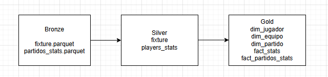
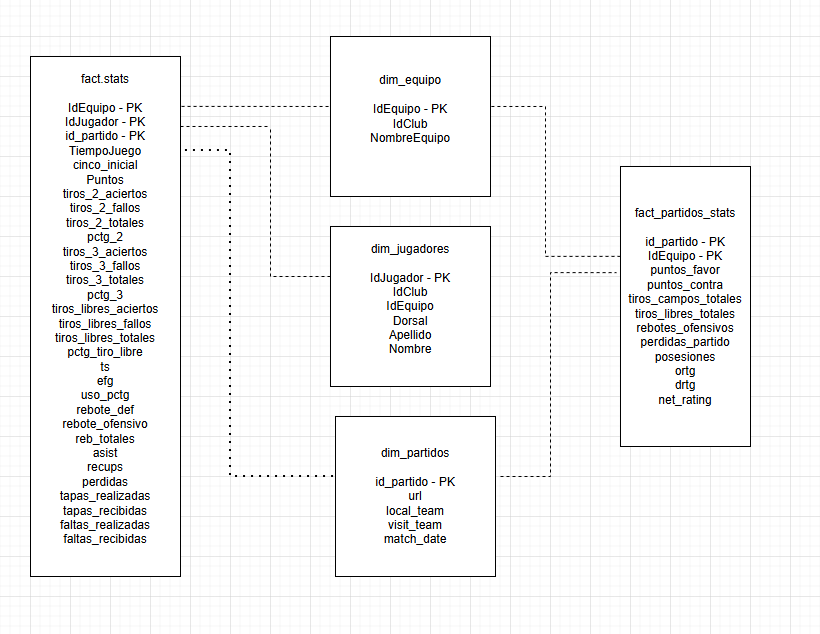
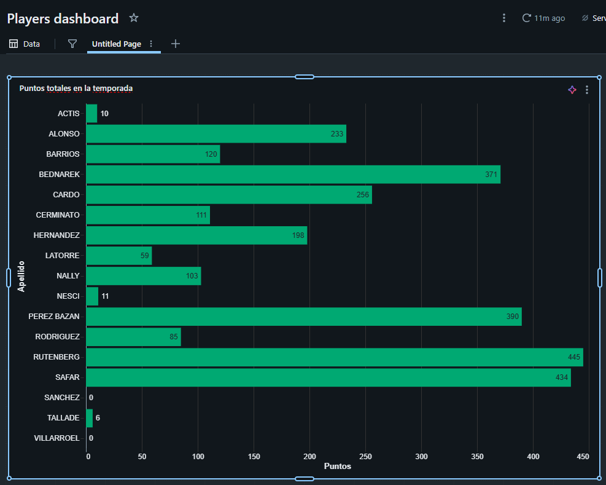

### CourtMetrics

 Project focused on the professional basketball league from Argentina,

 We can find a lot of data for NBA basketball league around the web, even for European League with all the data and advanced metrics, I would like to introduce this for LNB, the Argentinian basketball league.

 Why this project? We cannot find any public advanced data such as USO, TS, eFG, etc, do the teams have a way to access or build this data? We don't know, but is a key point to understand what is the level from the league at these days.

 These advanced metrics can help the teams to understand the weak points but also the strong ones, using metrics to improve decision-making on and off the court

 This project - CourtMetrics aims to bring data-driven analysis to LNB and the team selected for the MVP in this case, is San Lorenzo de Almagro, a basketball club based in the Boedo neighborhood of Buenos Aires, Argentina.

 To build this we selected the stack below

 ### Data ingestion
 Python + Playwright - for web scrapping

 ### Data Storage
 Parquet
 Delta Lake

 ### Data Processing
 Spark SQL
 Databricks

 Architecture
 Medallion Architecture
 Star Schema

 ### Stage 1 - MVP - Finished ### 

 About the MVP - 

 We scraped using Playwright from the web from laliganacional.com.ar and stored it as parquet format in Databricks.

 From that point, I started to build the architecture with 3 layers, bronze, silver and gold, the standard Medallion Architecture.

 Bronze - raw data
 Silver - cleaned and transformed data
 Gold - advanced metrics ready to analysis

 Every step was considering the quality data, that's why it was very important the EDA for every parquet to go further in the analysis before moving to the next the layers.

 We finished the layers 

 

 And the star schema

 

 Even this, we have the possibility to make some quick insights with this MVP

 

 ###Stage 2 - Scale to all teams

 Scrape all the teams from the league, expanding all the layers and enable cross-team comparisons

 ###Stage 3 - Compare metrics with others top leagues

 To understand the true level of the league and conclude percentiles and stablish local standards according to this level

 ###Stage 4 - Play by play
 Scrape play by play data from each game and calculate the exact possesions instead of estimated

 ###Stage 5 - Dashboards

 Use visual analysis filtered by teams, players, game or season
